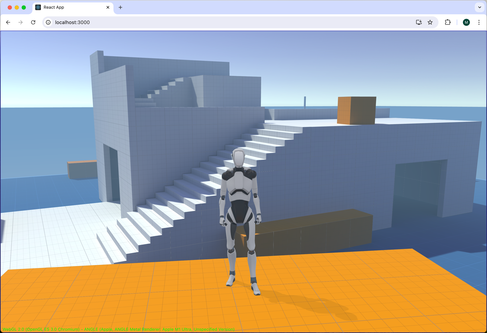

# Using Exported Unity Content




## Babylon Toolkit Extension

A universal runtime library for advanced BabylonJS game development.

https://github.com/BabylonJS/BabylonToolkit


## Awesome Design Documents

https://github.com/voltagent/awesome-design-md


## Unity Asset Store

The Starter Assets are free and light-weight first and third person character base controllers for the latest Unity 2023 LTS Or Greater

https://assetstore.unity.com/packages/essentials/starter-assets-character-controllers-urp-267961


* Default Installation (ES6)
```bash
npm install @babylonjs/core @babylonjs/gui @babylonjs/loaders @babylonjs/materials @babylonjs/inspector @babylonjs/serializers @babylonjs/havok @babylonjs/addons @babylonjs-toolkit/next
```

* Default Module Import Libraries
```javascript
import { Engine, Scene } from "@babylonjs/core";
import { HavokPlugin } from "@babylonjs/core/Physics/v2/Plugins/havokPlugin";
import HavokPhysics from "@babylonjs/havok";
import { SceneManager, ScriptComponent } from "@babylonjs-toolkit/next";
```

* Granular File Level Import Libraries
```javascript
import { Engine } from "@babylonjs/core/Engines/engine";
import { Scene } from "@babylonjs/core/scene";
import { HavokPlugin } from "@babylonjs/core/Physics/v2/Plugins/havokPlugin";
import HavokPhysics from "@babylonjs/havok";
import { SceneManager } from "@babylonjs-toolkit/next/scenemanager";
import { ScriptComponent } from "@babylonjs-toolkit/next/scenemanager";
import { LocalMessageBus } from "@babylonjs-toolkit/next/localmessagebus";
import { CharacterController } from "@babylonjs-toolkit/next/charactercontroller";
```

* Legacy Global Namespace Import Libraries
```javascript
import * as BABYLON from "@babylonjs/core/Legacy/legacy";
import { HavokPlugin } from "@babylonjs/core/Physics/v2/Plugins/havokPlugin";
import HavokPhysics from "@babylonjs/havok";
import * as TOOLKIT from "@babylonjs-toolkit/next";
import * as PROJECT from "@babylonjs-toolkit/next/project";
```

### Vite Configuration (ES6)

The Vite bundle services behave differently in devmode than production. To preserve some required classes during devmode, these `exclude` and `include` settings are strongly recommended in your vite.config.js settings file.

* Important: The `dedupe` section of the `vite.config` is required for dual-instance hazard prevention. You must setup vite applications to `dedupe` ad Next.js to set `config simlink` to false.

```json
  optimizeDeps: {
    exclude: [
      "@babylonjs/core",
      "@babylonjs/loaders",
      "@babylonjs/gui",
      "@babylonjs/materials",
      "@babylonjs/serializers",
      "@babylonjs/addons",
      "@babylonjs/havok",
      "@babylonjs/inspector",
      "@babylonjs-toolkit/next",
      "@babylonjs-toolkit/next/project",
    ],
    include: mode === 'development' ? [
      "scheduler",
      "use-sync-external-store/shim"
    ] : [],
  },
```

* Starter Content Import Libraries
```javascript
import { DefaultCameraSystem } from "@babylonjs-toolkit/next/starter/DefaultCameraSystem";
import { DebugInformation } from "@babylonjs-toolkit/next/starter/DebugInformation";
import { StandardCarController } from "@babylonjs-toolkit/next/racing/StandardCarController";
```

### Babylon Toolkit Starter Repositories (ES6)

* **Default Starter Project**: `https://github.com/babylontoolkit/StarterAssets.git`

* **Next.js Starter Project**: `https://github.com/babylontoolkit/VercelAssets.git`

---

Note: The **BABYLON** and **TOOLKIT** and **PROJECT*** namespaces are globally accessible for UMD style project script bundles.
